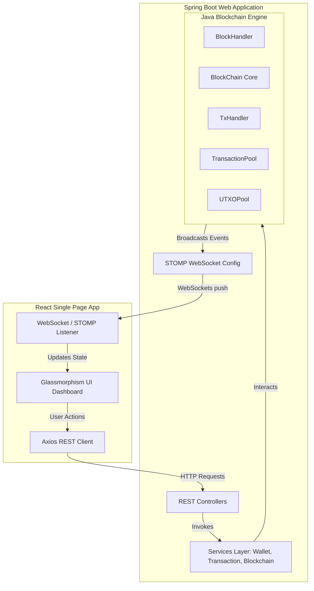

# 🪙 Mini-Bitcoin Full-Stack Blockchain Web Application

[](https://www.oracle.com/java/)
[](https://spring.io/projects/spring-boot)
[](https://react.dev/)
[](https://vitejs.dev/)
[](https://opensource.org/licenses/MIT)

An interactive, premium full-stack web application that visualizes and executes a simplified tree-structured **Bitcoin Blockchain** protocol. This project wraps a solid Java-based blockchain core (modeled after the Princeton Bitcoin and Cryptocurrency Technologies principles) in a modern Spring Boot REST API and a real-time, high-fidelity React dashboard.

---

## 📸 Interactive UI Showcase

### 📊 Dashboard & Live Network Feed
A centralized control room displaying real-time node stats (circulating supply, chain height, pending transactions) alongside a live activity ticker.

*Real-time stats and general status dashboard*


*Detailed activity panels and system information*

---

### ⛓️ Tree-Structured Blockchain Viewer
Visualize the blockchain tree graph, select individual blocks, inspect coinbase rewards, and review verified transactions within each block.

*Interactive blockchain node sequence*


*Expanded block inspector showing inner transactions and parameters*

---

### 💼 Wallet Manager
Generate secure RSA-backed wallet addresses instantly, verify current balances calculated from the UTXO pool, and examine unspent outputs.

*Wallet overview showing balances and addresses*


*Wallet detail with specific UTXO components*

---

### 💸 Transaction Terminal
Create and sign transactions using digital signatures. The terminal automatically fetches valid UTXOs, calculates inputs, returns change, and signs the payload before broadcasting.

*Transaction execution interface and transaction ledger*

---

### ⛏️ Mining Console
Claim block rewards! Select a miner address, package valid transactions from the memory pool, resolve double-spending conflicts, and mine a new block onto the max-height chain tip.

*Mining control room showing state transition and animations*

---

## ⚙️ Core Blockchain Concepts Implemented

The underlying Java core is fully integrated into the backend architecture, preserving all academic and crypto-economic rules:

*   **Tree-Structured Chain Branching**: The blockchain handles forks and parallel branches. The main chain is always calculated as the branch starting from the genesis block with the maximum level height.
*   **UTXO Transaction Model**: Transactions do not use account balances. Instead, they reference Unspent Transaction Outputs (UTXOs). A transaction consumes existing UTXOs as inputs and generates new UTXOs as outputs.
*   **Pruning & Memory Optimization (`CUT_OFF_AGE = 10`)**: To avoid memory overflow, the system only maintains limited block nodes in memory. Any blocks at a height below `(maxHeight - CUT_OFF_AGE)` are pruned from active memory.
*   **Cryptographic Security**:
    *   **SHA-256 Hashing**: Applied to calculate block and transaction hashes to guarantee immutability.
    *   **RSA Signatures (`SHA256withRSA`)**: Wallets contain public/private key pairs. Every transaction input is cryptographically signed to prove ownership of the consumed UTXO.
*   **Double-Spending & Validity Rules**: The system validates:
    1.  All claimed inputs exist in the current active UTXO pool.
    2.  Signatures on each input match the owner's public key.
    3.  No UTXO is spent multiple times in the same transaction or block.
    4.  All output values are non-negative.
    5.  The sum of input values is greater than or equal to the sum of output values (excess is left as a fee).

---

## 🏗️ System Architecture

The application is structured into decoupled layers, utilizing WebSockets for asynchronous server-push state synchronization:



---

## 🛠️ Technology Stack

### Backend
*   **Language**: Java 17
*   **Framework**: Spring Boot 3.x
*   **Networking**: Spring Web (REST API), Spring WebSocket (STOMP protocol)
*   **Utilities**: Jakarta Validation, Lombok, Apache Commons / Hex conversions
*   **Test**: JUnit 5, Spring Boot Test

### Frontend
*   **Core**: React 18, Vite
*   **State & Routing**: React Router DOM v6, React Context API
*   **HTTP & Real-Time**: Axios, `@stomp/stompjs`, `sockjs-client`
*   **Styling & FX**: Custom Vanilla CSS Tokens, Lucide Icons, Framer Motion (micro-animations)

---

## 🚀 Getting Started

### Prerequisites
*   [Java Development Kit (JDK) 17](https://adoptium.net/) or higher
*   [Apache Maven 3.8+](https://maven.apache.org/)
*   [Node.js 18+](https://nodejs.org/) and npm

### 1. Launch the Spring Boot Server
```bash
cd backend
mvn spring-boot:run
```
The server will start on port `8080` (accessible at `http://localhost:8080`).

### 2. Launch the React Client
Open a new terminal window:
```bash
cd frontend
npm install
npm run dev
```
The application will launch on `http://localhost:5173`.

---

## 🔌 API Documentation Reference

### Blockchain Interface
| Method | Endpoint | Description |
| :--- | :--- | :--- |
| `GET` | `/api/blockchain/status` | Retrieves status details of the chain height, totals, and mempool size. |
| `GET` | `/api/blockchain/blocks` | Returns the entire chain as an ordered list of Block DTOs. |
| `GET` | `/api/blockchain/blocks/{hash}` | Fetch full details of a specific block by its hex-encoded hash. |
| `POST` | `/api/blockchain/mine` | Mine a new block containing pending transactions using a specified miner wallet. |

### Wallets Interface
| Method | Endpoint | Description |
| :--- | :--- | :--- |
| `POST` | `/api/wallets` | Generate a new RSA wallet with a friendly name. |
| `GET` | `/api/wallets` | List all wallets currently loaded in the memory state. |
| `GET` | `/api/wallets/{id}` | Retrieve details, address (public key), and balance of a specific wallet. |
| `GET` | `/api/wallets/{id}/utxos` | Retrieve active UTXO segments owned by the wallet. |

### Transactions Interface
| Method | Endpoint | Description |
| :--- | :--- | :--- |
| `POST` | `/api/transactions` | Submit, sign, validate, and broadcast a new transaction to the mempool. |
| `GET` | `/api/transactions/pending` | Fetch the list of pending transactions in the mempool. |
| `GET` | `/api/transactions/{hash}` | Fetch the inputs, outputs, and status of a transaction by its hash. |

---

## 🧪 Development Validation

### Backend Verification
Verify that core cryptographic validations, UTXO processing, and tree structure checks compile and pass successfully:
```bash
cd backend
mvn clean test
```

### Frontend Optimization
Compile the client bundle to ensure zero typing or styling errors:
```bash
cd frontend
npm run build
```

---

## 📝 MIT License
This project is licensed under the MIT License - see the [LICENSE](LICENSE) file for details.
